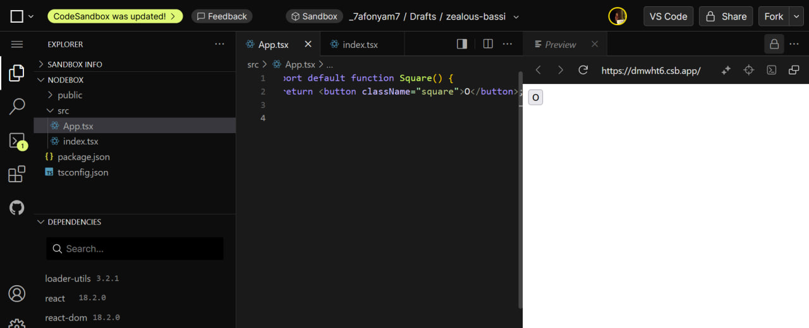
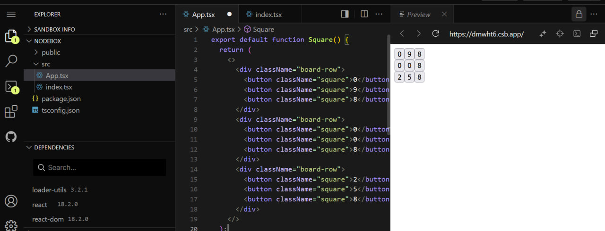
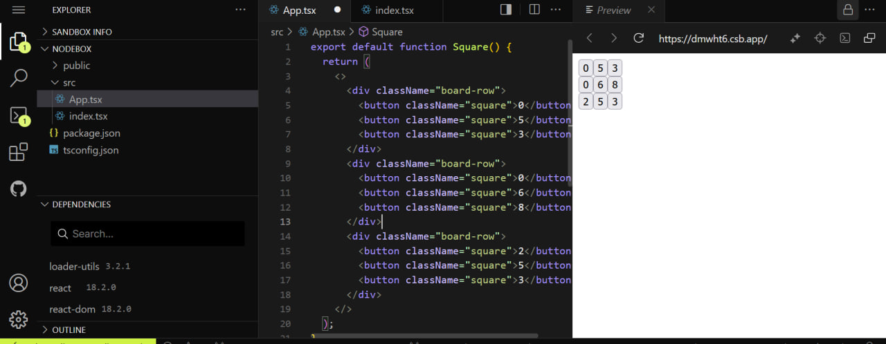
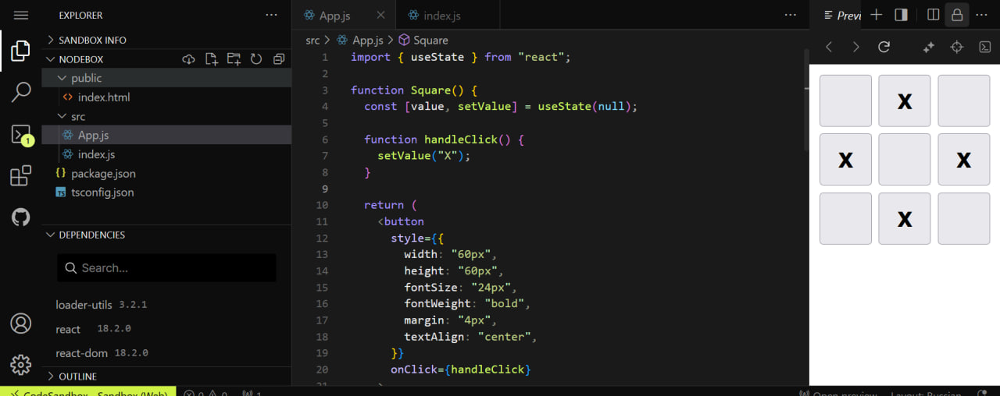
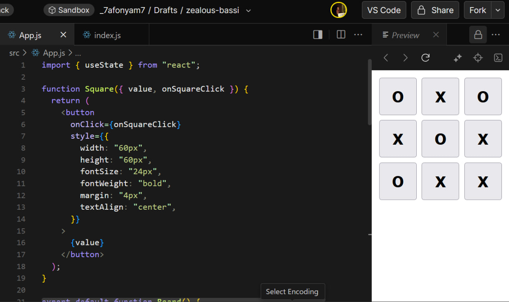
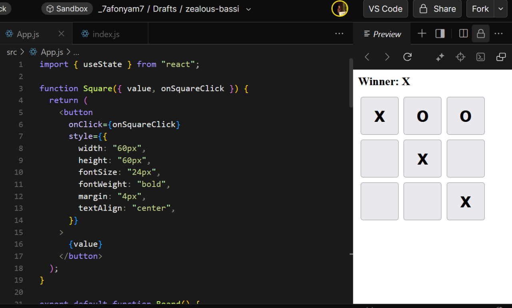
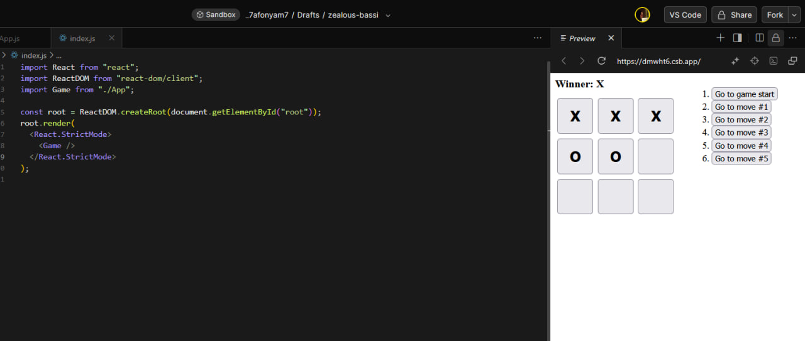

# PR-5-AfanasievMykhailo
## Афанасьєв Михайло Михайлович IПЗ 3.02 Практична робота № 5
## Тема: Ознайомлення з React через інтерактивний туторіал, основи компонентного підходу
## Мета: Ознайомитися з базовими концепціями бібліотеки React, зокрема з компонентним підходом, декларативним стилем опису інтерфейсів та принципом оновлення стану. Сформувати початкове уявлення про створення інтерфейсів за допомогою React та підготуватись до реалізації власних UI-компонентів.
## Хід роботи
## Завдання 1. Пройти розділ Quick Start на офіційному сайті React: https://react.dev/learn
1. Я пройшов розділ Quick Start на офіційному сайті React та навчився наступним речам:
- Створення та вкладення компнентів
- Додавання розмітки та стилів
- Відображення інформації
- Візуалізування умов та списків
- Реагування на події та оновлювання екрану
- Ділення інформацією між компонентами
  

Рис. 1 - Кінець проходження розділу

## Завдання 2. Ознайомитися з основними поняттями:
- JSX
- функціональні компоненти
- props
- state
- обробка подій
- рендеринг списків
- умовний рендеринг
- односторонній потік даних (one-way data flow)
Я ознайомився з основними поняттями:
### JSX
JSX - це розширення синтаксису JavaScript, яке дозволяє писати HTML-подібну структуру в JavaScript коді. Це спрощує створення та візуалізацію елементів React.
### Функціональні компоненти
Функціональні компоненти - це JavaScript-функції, які приймають props і повертають React-елементи. Вони простіші за класові компоненти і стали основним способом створення компонентів у сучасному React.
### Props
Props (властивості) - це об'єкти, які передаються від батьківського компонента до дочірнього. Вони дозволяють передавати дані між компонентами і є незмінними (read-only).
### State
State (стан) - це об'єкт, який містить дані, специфічні для компонента. Коли стан змінюється, компонент перерендерюється. У функціональних компонентах state керується за допомогою хука useState.
### Обробка подій
Обробка подій у React схожа на обробку подій у DOM, але використовує camelCase (onClick замість onclick) і передає функції, а не рядки. Це дозволяє компонентам реагувати на дії користувача.
### Рендеринг списків
Для відображення колекцій даних у React використовується метод map(), який трансформує масиви у списки елементів, при цьому кожен елемент потребує унікального атрибута key для оптимізації.
### Умовний рендеринг
Умовний рендеринг дозволяє відображати різні елементи в залежності від умов, використовуючи стандартні умовні оператори JavaScript, тернарні оператори або логічні оператори.
### Односторонній потік даних
Односторонній потік даних означає, що дані в React течуть в одному напрямку: від батьківських компонентів до дочірніх. Це робить програму передбачуваною та полегшує розуміння того, як дані змінюються з часом.

## Завдання 3. Пройти інтерактивний підручник Tutorial: Tic-Tac-Toe, реалізувавши гру «Хрестики-нулики»: https://react.dev/learn/tutorial-tic-tac-toe
1. Я почав проходження інтерактивного підручника Tutorial: Tic-Tac-Toe, скопіювавши архів з застосунку CodeSandbox та запустивши розробницький сервер для перегляду результату своїх дій:

Рис. 2 - Початок розробки
2. Використовуючи підручник як інструкцію я створив поле для гри

Рис. 3 - Реалізація поле гри
3. Наступним чином було реазізовано подію натиску на кнопку і зміну поля на Х

Рис. 4 - Подія натиску поля
4. Далі було виконано додавання функціоналу чередування О та Х 

Рис. 5 - Функціонування чередування
5. Вже після цього можно робити реалізацію находження переможця та наступного гравця

Рис. 6 - Реалізація находження переможця
6. Потім робимо функціонал подорожу у часі для переігрування ходів

Рис. 7 - Реалізація подорожу у часі
7. Далі завершуємо підручник і поліруємо функціонал коду для правильної роботи, код застосунку App.js буде прикріплено в цьому репозіторії.
## Завдання 4. Звернути увагу на:
- розбиття інтерфейсу на компоненти;
- використання state для зберігання історії ходів;
- реалізацію функціональності «скасування ходу» (undo).

### Розбиття інтерфейсу на компоненти
Це означає поділ інтерфейсу застосунка на менші, незалежні та перевикористовувані частини, які називаються компонентами. Кожен компонент відповідає за конкретну функціональність або елемент інтерфейсу.
### Як це працює:
- Компоненти можуть бути вкладеними один в одного 
- Кожен компонент має свою логіку та відображення
- Це спрощує розробку і подальше обслуговування коду
- Дозволяє повторно використовувати елементи інтерфейсу

### Використання state для зберігання історії ходів
State (стан) використовується для збереження даних про попередні дії користувача, зокрема історію ходів у грі або інших операцій, які можуть потребувати відстеження.
### Як це працює:
- Кожен хід зберігається як окремий елемент у масиві станів
- При кожній дії користувача новий стан додається до історії
- Поточний стан гри/інтерфейсу визначається на основі цієї історії
- React автоматично оновлює відображення при зміні стану

### Реалізація функціональності «скасування ходу» (undo)
Це можливість повернутися до попереднього стану застосунку, скасовуючи останню дію або повертаючись до будь-якого попереднього кроку з історії.
### Як це працює:
- Оскільки всі попередні стани збережені в історії, можна просто "перемотати" до потрібного стану
- Реалізується шляхом вибору певного елементу з масиву історії станів
- При виборі попереднього стану інтерфейс оновлюється, щоб відображати цей стан
- Користувач може взаємодіяти з кнопками або списком, що показує доступні попередні стани

## Висновок
У ході виконання лабораторної роботи я ознайомився з базовими концепціями бібліотеки React, зокрема з компонентним підходом, декларативним стилем опису інтерфейсів та принципом оновлення стану та сформував початкове уявлення про створення інтерфейсів за допомогою React та підготувався до реалізації власних UI-компонентів.
